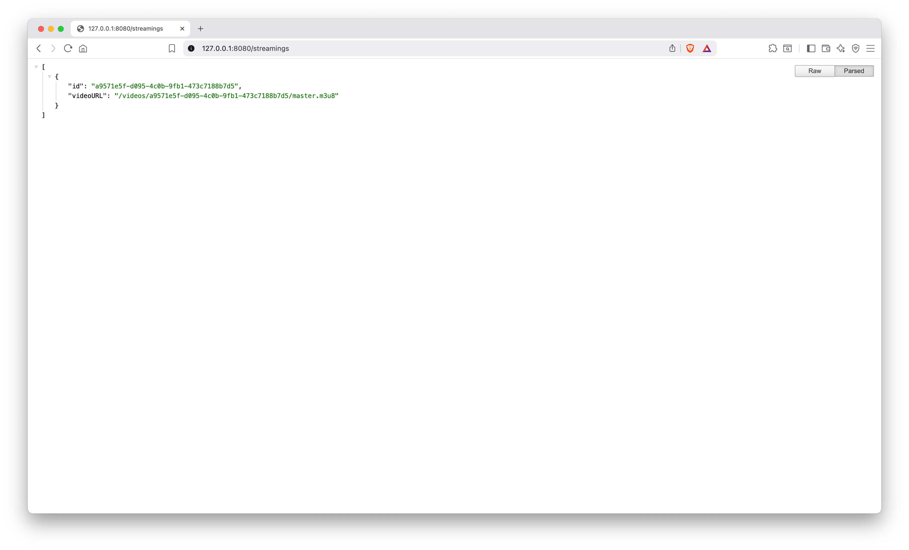
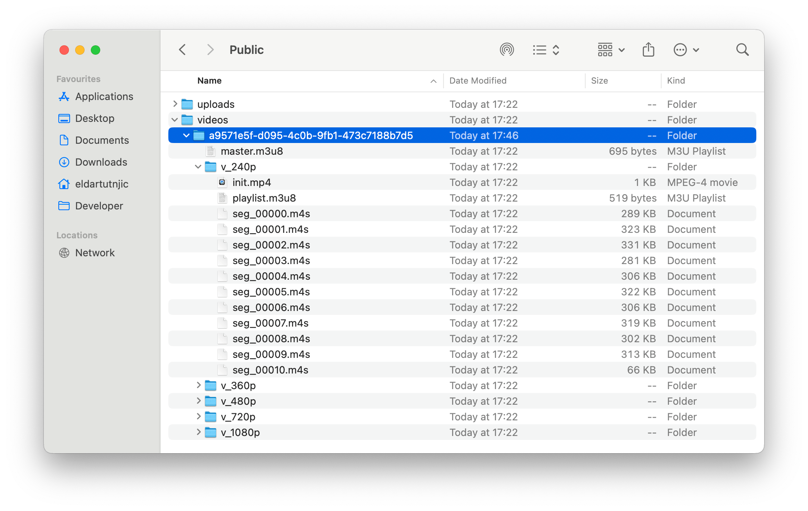
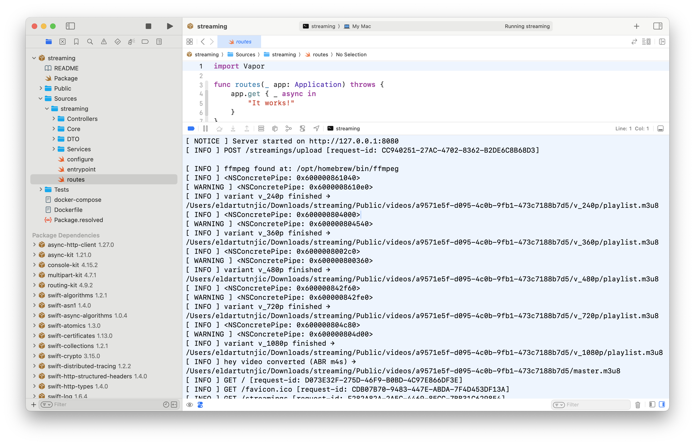
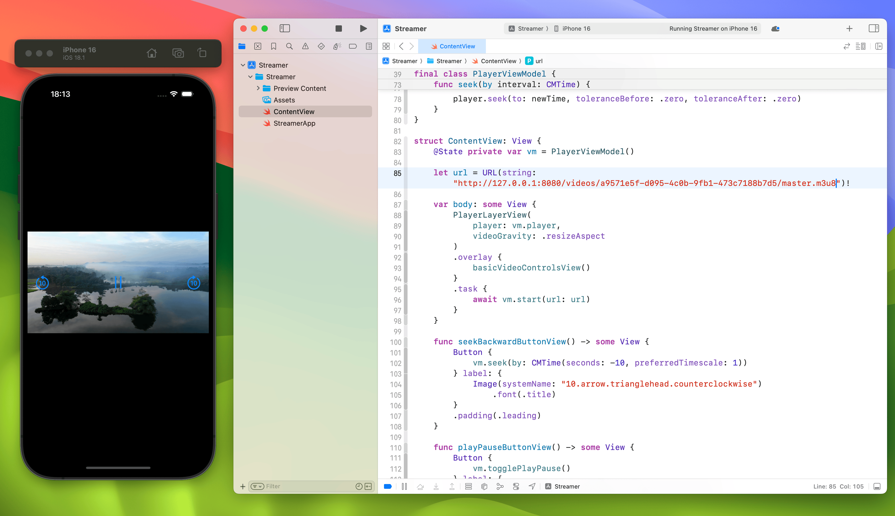

# Swift Vapor HLS upload + transcoding (demo)

This is only a demonstration. Uses Swift 6 + Vapor. No database. Files go to `Public/`. Upload a video, server makes HLS with fMP4 segments (`.m4s`) and a master playlist.

## Run

```bash
swift build
swift run
# server listens on http://127.0.0.1:8080
```

Static files are served from `Public/` via `FileMiddleware`.

## Upload a videoz

Replace the path with your file.

```bash
curl -X POST http://127.0.0.1:8080/streamings/upload   -F "file=@{PATH TO YOUR VIDEO}"
```

Example path on macOS:

```
{PATH TO YOUR VIDEO} = /Users/you/Desktop/video.mp4
```

## What you get back

JSON with an id and a relative HLS URL.

```json
{
  "id": "3756735b-7ffe-404a-aac0-987097dc5357",
  "videoURL": "/videos/3756735b-7ffe-404a-aac0-987097dc5357/master.m3u8"
}
```

Full URL is your host plus `videoURL`, for example:

```
http://127.0.0.1:8080/videos/3756735b-7ffe-404a-aac0-987097dc5357/master.m3u8
```

## List all streams

```bash
curl http://127.0.0.1:8080/streamings
```

Response shape:

```json
[
  {
    "id": "<uuid>",
    "videoURL": "/videos/<uuid>/master.m3u8"
  }
]
```

## Folder layout

After a successful upload and transcode:

```
Public/
  uploads/
    <uuid>.mp4
  videos/
    <id>/
      master.m3u8
      v_240p/
        init.mp4
        playlist.m3u8
        seg_00001.m4s
        seg_00002.m4s
        ...
      v_360p/
        init.mp4
        playlist.m3u8
        seg_00001.m4s
        ...
      v_480p/
        ...
      v_720p/
        ...
      v_1080p/
        ...
```

- `master.m3u8` refers to the per-variant playlists
- each variant folder contains `init.mp4` and `.m4s` segments

## Player notes

- Safari, iOS, tvOS and AVPlayer handle HLS natively
- browsers like Chrome need hls.js if you play in-page
- use the `master.m3u8` URL for adaptive bitrate
- if you want to force a quality, load a variant playlist directly, for example `/videos/<id>/v_720p/playlist.m3u8`

## Transcoding profile used

ABR ladder (H.264 + AAC, fMP4 segments):

- 240p around 400 kbps video, 96 kbps audio
- 360p around 800 kbps video, 96 kbps audio
- 480p around 1200 kbps video, 128 kbps audio
- 720p around 2800 kbps video, 128 kbps audio
- 1080p around 5000 kbps video, 160 kbps audio

Segment duration is 6 seconds. Playlists contain `#EXT-X-INDEPENDENT-SEGMENTS`.

## Requirements and behavior

- ffmpeg must be available in PATH
- the app will try to locate ffmpeg and can install it if missing on supported systems
- everything is written under `Public/`, so files are publicly reachable

## Troubleshooting

- if upload fails with a 500 and logs mention ffmpeg not found, make sure `ffmpeg` is installed and visible in PATH
- if you see the JSON response but playback fails in a browser, try Safari or use a page with hls.js
- on device instead of Simulator, use your Mac LAN IP not 127.0.0.1

This is only a demonstration.

## Screenshots

API response from `/streamings` with id and video URL  


Folder layout in `Public/videos/<id>` after transcoding  


Vapor server console output showing ffmpeg creating variants and playlists  


App running on iOS simulator with AVPlayer streaming from the backend  

